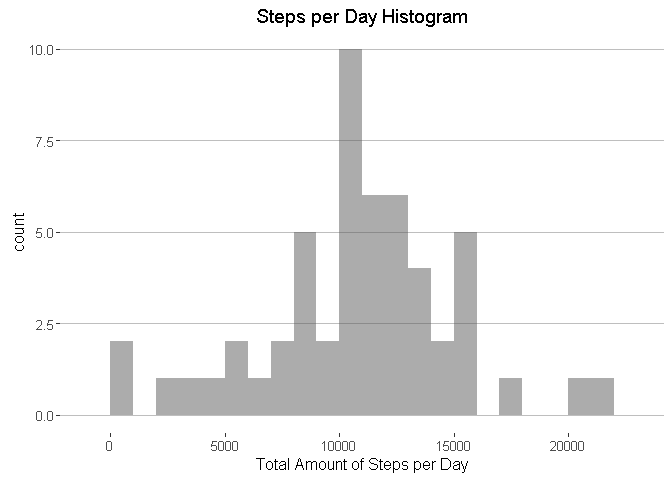
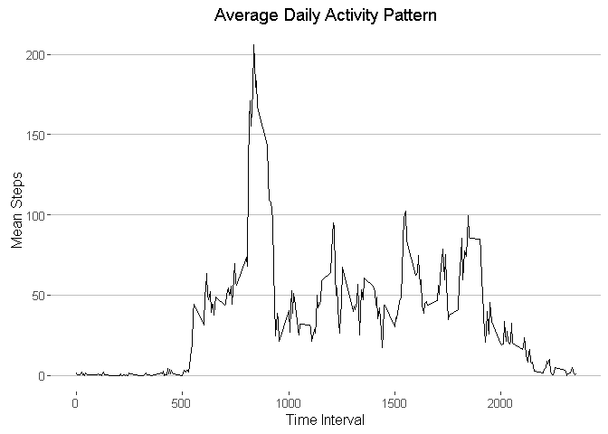

# Reproducible Research: Peer Assessment 1
## Global Document Options

```r
library(knitr)

# Define Significant Digits for Output
opts_chunk$set(R.options=options(digits = 2))

# Override the Inline Hook for Significant Digits to Match
# From Stack Overflow -- http://bit.ly/2263m7g
inline_hook <- function(x) {
    if(is.numeric(x)) x <- round(x, 2)
    paste(as.character(x), collapse=", ")
}
knit_hooks$set(inline = inline_hook)
```

## Required Libraries

```r
library(dplyr)
library(ggplot2)
library(ggthemes)
```

## Loading and preprocessing the data

```r
# Load CSV Activity Data and Define Data Types
df <- read.csv(unz("activity.zip", "activity.csv"), 
               colClasses = c("steps" = "integer",
                              "date" = "Date",
                              "interval" = "integer"))

# Review Data Frame Composition
str(df)
```

```
## 'data.frame':	17568 obs. of  3 variables:
##  $ steps   : int  NA NA NA NA NA NA NA NA NA NA ...
##  $ date    : Date, format: "2012-10-01" "2012-10-01" ...
##  $ interval: int  0 5 10 15 20 25 30 35 40 45 ...
```

```r
###
# Build Means and Sum Vectors for Later Use
###

# Vectpr of Step Sums by Day
day.sums = df %>% 
  group_by(date) %>% 
  summarize(steps = sum(steps))

# Vector of Means by 5 Minute Interval
interval.means = df %>% 
  group_by(interval) %>% 
  summarize(steps = mean(steps, na.rm = T))
```

## What is mean total number of steps taken per day?


```r
ggplot(day.sums, aes(steps)) + 
  geom_histogram(alpha = 0.5, binwidth = 1000) +
  theme_hc() +
  ggtitle("Steps per Day Histogram") +
  xlab("Total Amount of Steps per Day")
```



### Mean and Median Steps by Day Without NAs

The mean steps per day without NAs is 10766.19 and 
the median steps per day without NAs is 10765.

## What is the average daily activity pattern?

```r
ggplot(interval.means, aes(x = interval, y = steps)) +
  geom_line() +
  theme_hc() +
  ggtitle("Average Daily Activity Pattern") +
  xlab("Time Interval") +
  ylab("Mean Steps")
```




## Imputing missing values


## Are there differences in activity patterns between weekdays and weekends?

